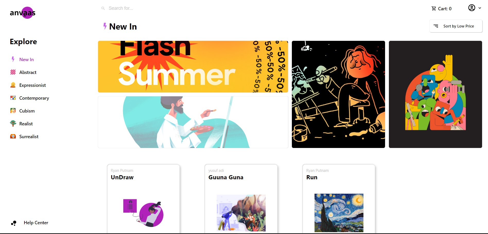

# ANVAAS - E-Commerce for Painters

## Description

I got idea for this project because of covid19 pandemi, I saw painters in my town, they have trouble how to sell their painting. Because event or showcase not allowed by goverment. So from that problem, I made Anvaas, E-commerce for the painters. Anvaas got from India word "कैनवास", so I process that word become anvaas.

## How to Use

``` console
npm run start
```

## Demo

If you wanna check this project just click [Anvaas](https://anvaas-43a4b.web.app "Anvaas")




<br />

## TECH

In this project, I use Javascript framework (React), Redux for management state, for the backend I using Firebase (Rest API Database, Firebase Storage, and Firebase Hosting).


<br />
<br />

---

### Connect with me:

[](https://www.makewithmyap.com "Make With MYAP")
[](https://www.youtube.com/channel/UCwyBVVRvT7q2bHnfbPjEwXg?view_as=subscriber "MYAP DEV")
[](https://twitter.com/myusufadp "@myusufadp")
[](https://www.linkedin.com/in/muhammad-yusuf-adi-purwanto-9451b6178 "Muhammad Yusuf Adi Purwanto")
[](https://www.instagram.com/myusufadp "@myusufadp")
